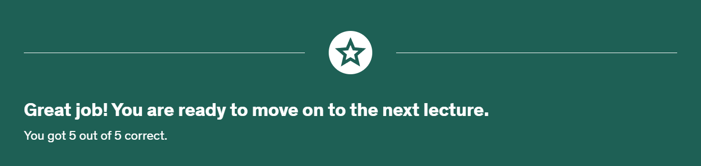
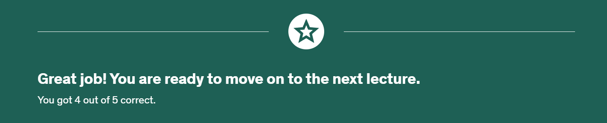

Bugun kod yazmamsam 27.12.2024 indi baslamisam yazandan snra push edecem
Bugun kod yazmamsam 28.12.2024 

# AlgorithmsDataStructures
This repository include my opinion and inspections about this course [JavaScript Algorithms and Data Structures Masterclass](https://www.udemy.com/course/js-algorithms-and-data-structures-masterclass/?couponCode=JUST4U02223)

## Table of contents
### Section 1: Introduction
- [1. Curriculum Walkthrough](https://www.udemy.com/course/js-algorithms-and-data-structures-masterclass/learn/lecture/8344040#content)
    - There was a brief overview of the course here, I skipped it.
- [2. Join The Community!](https://www.udemy.com/course/js-algorithms-and-data-structures-masterclass/learn/lecture/35421946#content)
    - He mentioned his social media and so on here, it was interesting and I subscribed, but Discord isn't interesting for me.
- [3. What Order Should You Watch In?](https://www.udemy.com/course/js-algorithms-and-data-structures-masterclass/learn/lecture/8344034#content)
  - He a bit talked about why we need to watch in this order and his explanation is acceptable for me
- [4. How I'm Running My Code](https://www.udemy.com/course/js-algorithms-and-data-structures-masterclass/learn/lecture/9816126#content)
    - He talked about which technologies i can write code for ex: "JsBin", "Atom", "SublimeText" etc. and a bit how we can use inspect tools like a snippets

### Section 2: Big O Notation
- [5. Intro to Big O](https://www.udemy.com/course/js-algorithms-and-data-structures-masterclass/learn/lecture/8344044#content)
    - Here Mr.Settle talks about why we really need to know "Big O Notation"
- [6. Timing Our Code](https://www.udemy.com/course/js-algorithms-and-data-structures-masterclass/learn/lecture/8344046#content)
    - He started talk about in situation why we need this and at the moment i'm also do it for best practise [here](./BigONotation/example_001.js) and i leanned new things
      - [performance.now() Method](https://www.geeksforgeeks.org/javascript-performance-now-method/)
- [7. Counting Operations](https://www.udemy.com/course/js-algorithms-and-data-structures-masterclass/learn/lecture/8344048#content)
    - I watched the video and understood, I didn't need to take notes. 
- [8. Visualizing Time Complexities](https://www.udemy.com/course/js-algorithms-and-data-structures-masterclass/learn/lecture/8344026#content)
    - Actualy i understood this topic, but i don't understand about graphics 🆘
- [9. Official Intro to Big O](https://www.udemy.com/course/js-algorithms-and-data-structures-masterclass/learn/lecture/11069998#content)
    - Mr.Settle talk about here a bit Linear, Quadratic, Constant etc. functions everything is clear
- [10. Simplifying Big O Expressions](https://www.udemy.com/course/js-algorithms-and-data-structures-masterclass/learn/lecture/11070006#content)
    - I watched the video and understood & practised [here](./BigONotation/example_002.js), I didn't need to take notes.
- [Quiz 1: Big O Time Complexity](https://www.udemy.com/course/js-algorithms-and-data-structures-masterclass/learn/quiz/4412974#content)

  
- [Quiz 2: Big O Time Complexity](https://www.udemy.com/course/js-algorithms-and-data-structures-masterclass/learn/quiz/4412976#content)

  
  - i'm understood my false no worries
- [11. Space Complexity](https://www.udemy.com/course/js-algorithms-and-data-structures-masterclass/learn/lecture/8344050#content)
    - I watched the video and understood, I didn't need to take notes.
- [Quiz 3: Big O Space Complexity](https://www.udemy.com/course/js-algorithms-and-data-structures-masterclass/learn/quiz/4412978#content)

  
  - i'm understood my false no worries    
- [12. Logs and Section Recap](https://www.udemy.com/course/js-algorithms-and-data-structures-masterclass/learn/lecture/11198496#content)
    - Thanks for Mr.Settle learned for me Logs again 😁, practises is  & practised [here](./BigONotation/example_003.js)

### Section 3: Analyzing Performance of Arrays and Objects
- [13. Prerequisites](https://www.udemy.com/course/js-algorithms-and-data-structures-masterclass/learn/lecture/11198496#content)
    - Oke 
- [14. Section Introduction](https://www.udemy.com/course/js-algorithms-and-data-structures-masterclass/learn/lecture/8344072#content)
    - Oke 
- [15. The BIG O of Objects](https://www.udemy.com/course/js-algorithms-and-data-structures-masterclass/learn/lecture/8344084#content)
    - Practises is [here](./ArraysObjects/example_001.js)
- [Quiz 4: Object Operations](https://www.udemy.com/course/js-algorithms-and-data-structures-masterclass/learn/quiz/424804#content)

  
- [16. When are Arrays Slow?](https://www.udemy.com/course/js-algorithms-and-data-structures-masterclass/learn/lecture/8344074#content)
    - I watched the video and understood, I didn't need to take notes. 
- [17. Big O of Array Methods](https://www.udemy.com/course/js-algorithms-and-data-structures-masterclass/learn/quiz/424802#content)
    - I watched the video and understood, I didn't need to take notes, but i will do some tasks about that . . .
- [Quiz 5: Array Operations](https://www.udemy.com/course/js-algorithms-and-data-structures-masterclass/learn/quiz/424804#content)

  

------------------------------------------------------------------
#### Credits
- Source: Udemy - [Colt Steele](https://www.udemy.com/course/js-algorithms-and-data-structures-masterclass/?couponCode=ST12MT122624)
